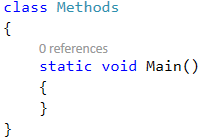
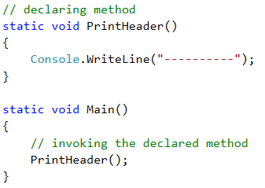
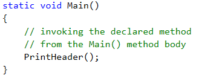
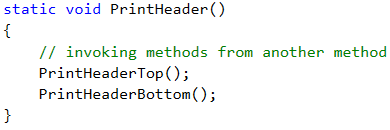
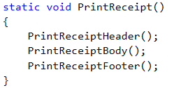
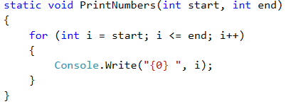

# Глава 10. Методи

В настоящата глава ще се запознаем с методи и ще научим какво представляват те, както и кои са базовите концепции при работа с тях. Ще научим защо е добра практика да ги използваме, как да ги декларираме и извикваме. Ще се запознаем с параметри и връщана стойност на метод, както и как да използваме тази връщана стойност. Накрая на главата, ще разгледаме утвърдените практики при използване на методите.

## Какво е "метод"?

До момента установихме, че при писане на код на програма, която решава дадена задача, ни улеснява това, че разделяме задачата на части. Всяка част отговаря за дадено действие и по този начин не само ни е по-лесно да решим задачата, но и значително се подобрява както четимостта на кода, така и проследяването за грешки.

Всяко едно парче код, което изпълнява дадена функция и което сме отделили логически, може да изземе функцията на метода. Точно това представляват методите – парчета код, които са именовани от нас по определен начин и които могат да бъдат извикани по-късно толкова пъти, колкото имаме нужда.

Един метод може да бъде извикан толкова пъти, колкото ние преценим, че ни е нужно за решаване на дадена задача. Това ни спестява писането на един и същи код няколко пъти, както и намалява възможността да пропуснем грешка при евентуална корекция на въпросния код.

### Прости методи

Простите методи отговарят за изпълнението на дадена функция, която спомага за решаване на определена задача. Такива функции могат да бъдат разпечатване на даден низ на конзолата, извършване на някаква проверка, изпълнение на цикъл и т.н.

Нека разгледаме следния пример за прост метод.

Този метод има задачата да разпечата заглавие, което представлява поредица от символа `-`. Поради тази причина името му е `PrintHeader`. Кръглите скоби `( ` и `)` винаги следват името, независимо как сме наименовали метода. По-късно ще разгледаме как трябва да наименоваме методите, с които работим, а за момента ще отбележим само, че е важно името му да описва функцията, която той изпълнява.

Тялото на метода съдържа програмния код, който се намира между къдравите скоби `{` и `}`. Тези скоби винаги следват декларацията му, а в тялото на един метод не може да бъде деклариран друг такъв. Между къдравите скоби `{` и `}` поставяме кода, който изпълнява задачата, описана от името на метода. 

### Защо да използваме методи?

До тук установихме, че методите спомагат за разделянето на обемна задача на по-малки части, което води до по-лесно решаване на въпросното задание. Това прави програмата ни не само по-добре структурирана и лесно четима за нас и за други хора, но и по-разбираема.

Чрез методите избягваме повторението на програмен код. Повтарящият се код е лоша практика, тъй като силно затруднява поддръжката на програмата и води до грешки. Ако дадена част от кода ни присъства в програмата няколко пъти и се наложи да променим нещо, то промените трябва да бъдат направени във всяко едно повторение на въпросния код. Вероятността да пропуснем място, на което трябва да нанесем корекция, е много голяма, което би довело до некоректно поведение на програмата. Това е причината, поради която е добра практика, ако използваме даден фрагмент код повече от един или два пъти в програмата си, да го дефинираме като отделен метод. 

Методите ни предоставят възможността да използваме даден код няколко пъти. С решаването на все повече и повече задачи ще установите, че използването на вече съществуващи методи спестява много време и усилия. 

### Деклариране на методи

В езика C# декларираме методите в рамките на даден клас, т.е. между отварящата `{` и затваряща  `}` скоби на класа. Декларирането представлява регистрирането на метода в програмата, за да бъде разпознаван в останалата част от нея. Най-добре познатият ни пример за метод е метода `Main(…)`, който използваме във всяка една програма, която пишем.

Нека разгледаме следващия пример и да разгледаме задължителните елементи в декларацията на един метод.

* **Тип на връщаната стойност**. В случая типа е `double`, което означава, че методът от примера ще върне резултат, който е от тип `double`. Връщаната стойност може да бъде както `int`, `double`, `string` и т.н., така и `void`. Ако типът е `void`, то това означава, че методът не връща резултат, а само изпълнява дадена операция.
* **Име на метода**. Името на метода е определено от нас, като не забравяме, че трябва да описва функцията, която е изпълнявана от кода в тялото му. В примера името е `GetSquare`, което ни указва, че задачата на този метод е да изчисли лицето на квадрат.
* **Списък с параметри**. Декларира се между скобите `(` и `)`, които изписваме след името му. Тук изброяваме поредицата от параметри, които метода ще използва. Може да присъства само един параметър, няколко такива или да е празен списък. Ако няма параметри, то ще запишем само скобите `()`. В конкретния пример декларираме параметъра `double num`.

При деклариране на методи е важно да спазваме последователността на основните му елементи - първо тип на връщаната стойност, след това име на метода и накрая списък от параметри, ограден с кръгли скоби `()`.

След като сме декларирали метода, следва неговата **имплементация (тяло)**. В тялото на метода описваме алгоритъма, по който той решава даден проблем, т.е. тялото съдържа кода (програмен блок), който реализира логиката на метода. В показания пример изчисляваме лицето на квадрат, а именно `num * num`. 

Когато декларираме дадена променлива в тялото на един метод, я наричаме локална променлива за метода. Областта, в която съществува и може да бъде използвана тази променлива, започва от реда, на който сме я декларирали и стига до затварящата къдрава скоба `}` на тялото на метода. Тази област се нарича **област на видимост** на променливата. 

### Извикване на методи

Извикването на метод представлява **стартирането на изпълнението на кода**, който се намира в **тялото на метода**. Това става като изпишем **името** му, последвано от кръглите скоби **`()`** и знака **`;`**.

Даден метод може да бъде извикан от няколко места в нашата програма. Единият начин е да бъде извикан от главния метод.

Метод може да бъде извикан и от тялото на друг метод, който не е главния метод на програмата ни.

Съществува вариант метода да бъде извикан от собственото си тяло. Това се нарича рекурсия и можете да намерите повече информация за нея на адрес [https://bg.wikipedia.org/wiki/%D0%A0%D0%B5%D0%BA%D1%83%D1%80%D1%81%D0%B8%D1%8F](https://bg.wikipedia.org/wiki/%D0%A0%D0%B5%D0%BA%D1%83%D1%80%D1%81%D0%B8%D1%8F) или да потърсите сами в Интернет.

Важно е да знаем, че ако един метод е деклариран в даден клас, то той може да бъде извикван на по-горен ред от декларацията си.

### Пример: празна касова бележка

Да се напише метод, който печата празна касова бележка. Методът трябва да извиква други три метода: един за принтиране на заглавието, един за основната част на бележката и един за долната част.

|Част от касовата бележка|Текст|
|---|---|
|Горна част|CASH RECEIPT ------------------------------|
|Средна част|Charged to\_\_\_\_\_\_\_\_\_\_\_\_\_\_\_\_\_\_\_\_ Received by\_\_\_\_\_\_\_\_\_\_\_\_\_\_\_\_\_\_\_|
|Долна част|------------------------------ (c) SoftUni|

|Вход|Изход|
|---|---|
|(няма)|CASH RECEIPT ------------------------------ Charged to\_\_\_\_\_\_\_\_\_\_\_\_\_\_\_\_\_\_\_\_ Received by\_\_\_\_\_\_\_\_\_\_\_\_\_\_\_\_\_\_\_ ------------------------------ (c) SoftUni|

#### Насоки и подсказки

Първата ни стъпка е да създадем `void` метод за принтиране на заглавната част от касовата бележка. Нека му дадем смислено име, което описва кратко и ясно задачата му, например `PrintReceiptHeader`. В тялото му ще напишем кода от примера по-долу.

Същата стъпка ще изпълним и за разпечатване на средната и долната част на бележката. След това ще създадем още един метод, който ще извиква методите, които написахме до момента.

Накрая ще извикаме метода `PrintReceipt` от тялото на метода `Main`.

#### Тестване в Judge системата

Тествайте решението си тук: [https://judge.softuni.bg/Contests/Practice/Index/594#0](https://judge.softuni.bg/Contests/Practice/Index/594#0)

## Методи с параметри

Много често в практиката, за да бъде решен даден проблем, методът, с чиято помощ постигаме това, се нуждае от допълнителна информация, която зависи от задачата му. Именно тази информация представляват параметрите на метода и неговото поведение зависи от тях. 

### Използване на параметри в методите

Както отбелязахме по-горе, параметрите освен нула на брой, могат също така да са един или повече от един. При декларацията им ги разделяме със запетая. Те могат да бъдат от всеки един тип (`int`, `string` и т.н.), а по-долу е показан пример как точно ще бъдат използвани от метода.

Декларираме метода и списъка му с параметри, след което пишем кода, който той ще изпълнява.

След това извикваме метода и му подаваме конкретни стойности:

При декларирането на параметри можем да използваме различни типове променливи, като трябва да внимаване всеки един параметър да има тип и име. Важно е да отбележим, че при последващото извикане на метода, трябва да подаваме стойности за параметрите по реда, в който са декларирани самите те. Ако имаме подадени параметри в реда `int` и след това `string`, при извикването му не можем да подадем първо стойност за `string` и след това за `int`. 

Нека разгледаме примера за декларация на метод, който има няколко параметъра от различен тип.

### Пример: знак на цяло число

Да се създаде метод, който печата знака на цяло число n.

|Вход|Изход|
|---|---|
|2|The number 2 is positive.|
|-5|The number -5 is negative.|
|0|The number 0 is zero.|

#### Насоки и подсказки

Първата ни стъпка е създаването на метод и даването му да описателно име, например `PrintSign`. Този метод ще има само един параметър от тип `int`. 

Следващата ни стъпка е имплементирането на логиката, по която програмата ни ще проверява какъв точно е знака на числото. От примерите виждаме, че има три случая - числото е по-голямо от нула, равно на нула или по-малко от нула, което означава, че ще направим три проверки в тялото на метода. 

Следващата ни стъпка е да прочетем входното число и да извикаме новия метод от тялото на `Main` метода.

#### Тестване в Judge системата

Тествайте решението си тук: [https://judge.softuni.bg/Contests/Practice/Index/594#1](https://judge.softuni.bg/Contests/Practice/Index/594#1)

### Незадължителни параметри

Езикът C# поддържа използването на незадължителни параметри. Те позволяват пропускането на параметри при извикването на метода. Декларирането им става чрез осигуряване на стойност по подразбиране при декларирането на самия метод.

Следващият пример онагледава употребата на незадължителните параметри.

Показаният метод `PrintNumbers` може да бъде извикан по няколко начина:

### Пример: принтиране на триъгълник

Да се създаде метод, който принтира триъгълник, както е показано в примерите.

|Вход|Изход|Вход|Изход|
|---|---|---|---|
|3|1 1 2 1 2 3 1 2 1|4|1 1 2 1 2 3 1 2 3 4  1 2 3 1 2 1|

#### Насоки и подсказки

Преди да създадем метод за принтиране на един ред с дадени начало и край, прочитаме входното число от конзолата. След това избираме смислено име за метода, което описва целта му, напр. `PrintLine`.

От задачите за рисуване на конзолата си спомняме, че е добра практика да разделяме фигурата на няколко части. За наше улеснение ще разделим триъгълника на три части - горна, средна линия и долна. Следващата ни стъпка е с цикъл да разпечатаме горната половина от триъгълника.

След това разпечатваме средната линия.

Накрая разпечатваме долната част от триъгълника, като този път стъпката на цикъла намалява.

#### Тестване в Judge системата

Тествайте решението си тук: [https://judge.softuni.bg/Contests/Practice/Index/594#2](https://judge.softuni.bg/Contests/Practice/Index/594#2)

### Пример: рисуване на запълнен квадрат

Да се нарисува на конзолата запълнен квадрат със страна n, както е показно в примерите.

|Вход|Изход|Вход|Изход|
|---|---|---|---|
|4|<code>--------</code> <code>-\\/\\/\\/-</code> <code>-\\/\\/\\/-</code> <code>--------</code>|5|<code>----------
</code> <code>-\\/\\/\\/\\/-</code> <code>-\\/\\/\\/\\/-</code> <code>-\\/\\/\\/\\/-</code> <code>----------
</code>|

#### Насоки и подсказки

Първата ни стъпка е да прочетем входа от конзолата. След това трябва да създадем метод, който ще принтира първия и последен ред, тъй като те са еднакви. Нека не забравяме, че трябва да му дадем описателно име и да му зададем като параметър дължината на страната. Ще използваме конструктора `new string`. 

Следващата ни стъпка е да създадем метод, който ще рисува на конзолата средните редове. Отново задаваме описателно име, напр. `PrintMiddleRow`.

Накрая извикваме създадените методи в главния метод на програмата, за да нарисуваме целия квадрат. 

#### Тестване в Judge системата
Тествайте решението си тук: [https://judge.softuni.bg/Contests/Practice/Index/594#3](https://judge.softuni.bg/Contests/Practice/Index/594#3)

## Връщане на резултат от метод

До момента разгледахме методи, които извършват дадена функция, например отпечатване на даден текст, число или фигура на конзолата. Освен този тип методи, съществуват и такива, които могат да връщат някакъв резултат. Именно тези методи ще разгледаме в следващите редове.

### Типове на връщаната от метода стойност

До сега разгледаждахме примери, в които при декларация на методи използвахме ключовата дума `void`, която указва, че методът не връща резултат, а изпълнява определено действие.

Ако заместим `void` с тип на стойност, то това ще укаже на програмата, че метода трябва да върне някаква стойност от указания тип. Тази върната стойност може да бъде от всякакъв тип – `int`, `string`, `double` и т.н. За да върне един метод резултат е нужно да внимаваме да напишем очаквания тип на резултата при декларацията на метода на мястото на `void`.

Важно е да отблежим, че резултатът, който се връща от метода, може да е от тип, съвместим с типа на връщаната стойност на метода. Например, ако декларираният тип на връщаната стойност е `double`, то можем да върнем резултат от тип `int`.

### Оператор return

За да получим резултат от метода, на помощ идва операторът `return`. Той трябва да бъде използван в тялото на метода и указва на програмата да спре изпълнението му и да върне в извикващия метод определена стойност, която се определя от израза след въпросния оператор.

Операторът `return` може да бъде използван и във `void` методи. Тогава самият метод ще спре изпълнението си, без да връща никаква стойност, а след него не трябва да има израз, който да бъде върнат. В този случай употребата на `return` е единствено за излизане от метода.

След `return` операторa не трябва да има други редове код, тъй като тогава Visual Studio ще покаже предупреждение, съобщавайки ни, че е засякъл код, който не може да бъде достъпен. Въпреки това, има случаи, в които `return` може да бъде извикван от няколко места в метода, но само ако има определени входни условия.

### Употреба на връщаната от метода стойност

След като даден метод е изпълнен и върне стойност, то тази стойност може да се използва по няколко начина.

Първият е да присвоим резултата като стойност на променлива от подходящ тип:

Вторият е резултатът да бъде използван в израз:

Третият е да подадем резултата от работата на метода като към друг метод:

// TODO: Фаренхайт-Целзий

### Пример: пресмятане на лицето на триъгълник

Да се напише метод, който изчислява лицето на триъгълник по дадени основа и височина и връща стойността му.

|Вход|Изход|
|---|---|
|3 4|6|

### Насоки и подсказки

Първата ни стъпка е да прочетем входа. След това създаваме метод, но този път внимаваме при декларацията да подадем коректния тип данни, които искаме метода да върне, а именно `double`.

Следващата ни стъпка е да извикаме новия метод в главния и да запишем върнатата стойност в нова променлива.

#### Тестване в Judge системата
Тествайте решението си тук: [https://judge.softuni.bg/Contests/Practice/Index/594#4](https://judge.softuni.bg/Contests/Practice/Index/594#4)

### Пример: степен на число

Да се напише метод, който изчислява и връща резултата от повдигането на число на дадена степен.

|Вход|Изход|Вход|Изход|
|---|---|---|---|
|2 8|256|3 4|81|

#### Насоки и подсказки

Първата ни стъпка отново ще е първо да прочетем входните данни от конзолата. Следващата стъпка е да създадем метод, който ще има два параметъра (числото и степента) и който ще връща като резултат число от тип `double`.

След като сме направили нужните изчисления, ни остава да разпечатаме резултата в главния метод на програмата.

#### Тестване в Judge системата
Тествайте решението си тук: [https://judge.softuni.bg/Contests/Practice/Index/594#5](https://judge.softuni.bg/Contests/Practice/Index/594#5)

## Варианти на методи

### Сигнатура на метода

В програмирането начинът, по който се идентифицира един метод, е чрез двойката елементи от декларацията му – име на метода и списък от неговите параметри. Тези два елемента определят неговата спецификация, т. нар. сигнатура на метода. 

В този пример сигнатурата на метода е неговото име (`Print`), както и неговият параметър (`string text`).

Ако в програмата ни има методи с еднакви имена, но с различни сигнатури, то казваме, че имаме варианти на методи (method overloading).

### Варианти на методи

Както споменахме, ако изпозлваме едно и също име за няколко метода с различни сигнатури, то това означава, че имаме варианти на метод. Кодът по-долу показва пример как три тразлични метода могат да са с едно и също име, но да връщат различни резултати.

### Сигнатура и тип на връщаната стойност

Важно е да отбележим, че връщаният тип като резултат на метода не е част от сигнатурата му. Ако връщаната стойност беше част от сигнатурата на метода, то няма как компилаторът да знае кой метод точно да извика.

Нека разгледаме следния пример - имаме два метода с различен тип на връщаната стойност. Въпреки това Visual Studio ни показва, че има грешка, защото сигнатурите и на двата са еднакви, съответно компилаторът не би могъл да реши кой от двата метода да извика.

### Пример: по-голямата от две стойности

Като входни данни са дадени две стойности от един и същ тип. Стойностите могат да са от тип `int`, `char` или `string`. Да се създаде метод `GetMax()`, който връща като резултат по-голямата от двете стойности.

|Вход|Изход|Вход|Изход|Вход|Изход|
|---|---|---|---|---|---|
|int 2> 16|16|char a z|z|string Ivan Todor|Todor|

#### Насоки и подсказки

За да създадем този метод, първо трябва да създадем три други метода с едно и също име и различни сигнатури. Първо създаваме метод, който ще сравнява цели числа.

Следвайки логиката от предходния метод, създаваме такъв със същото име, който обаче ще сравнява символи.

Следващият метод, който трябва да създадем, ще сравнява низове. Тук логиката ще е малко по-различна, тъй като стойностите от тип `string` не позволяват да бъдат сравнявани чрез операторите `<`и `>`. Ще изпозлваме метода `CompareTo(...)`, който връща числова стойност (по-голяма от 0 (сравняваният обект е по-голям), по-малка от 0 (сравняваният обект е по-малък) и 0 (при два еднакви обекта).

Последната стъпка е да прочетем входните данни, да използваме подходящи променливи и да извикаме метода `GetMax()` от тялото на метода `Main()`.

#### Тестване в Judge системата
Тествайте решението си тук: [https://judge.softuni.bg/Contests/Practice/Index/594#6](https://judge.softuni.bg/Contests/Practice/Index/594#6)

## Наименоване на методи. Добри практики при работа с методи

В тази част от главата за методи ще се запознаем с някои от утвърдените практики при работа с тях.

### Наименоване на метода

Когато наименоваме даден метод е препоръчително да изпозлваме смислени имена. Тъй като всеки метод отговаря за някаква част от нашата задача, то при наименоването му трябва да вземем предвид неговата функция, т.е. добра практика е името да описва неговата цел. Задължително е името да започва с главна буква и трябва да е съставено от глагол или от двойка – глагол и съществително име. Форматирането на името става, използвайки Upper Case Camel конвенцията, т.е. всяка дума, включително първата, започва с главна буква. Кръглите скоби `( ` и `)` винаги следват името му. 

Всеки метод трябва да изпълнява самостоятелна задача, а името на метода трябва да описва каква е неговата функция. 

Няколко примера за коректно наименоване на методи:
* `FindStudent`
*	`LoadReport`
*	`Sine`

Няколко примера за лошо наименоване на методи:
*	`Method1`
*	`DoSomething`
*	`HandleStuff`
*	`SampleMethod`
*	`DirtyHack`

Ако не можем да измислим подходящо име, то най-вероятно метода решава повече от една задача и тогава трябва да помислим как да го разделим на няколко отделни метода.

### Наименоване на параметрите на метода

При наименоването на параметрите на метода важат почти същите правила, както и при самите методи. Разликите тук са, че за тях е добре да използваме съществително име или прилагателно и съществително име, както и че при именоване на параметрите се спразва Lower Camel Case конвенцията, т.е. всички думи без първата започват с главна буква. Трябва да отбележим, че е добра практика името на параметъра да указва каква е мерната единица, която се използва при работа с него.

Няколко примера за коректно наименоване на параметри на методи:
* `firstName`
*	`report`
*	`speedKmH`
*	`usersList`
*	`fontSizeInPixels`
*	`font`

Няколко примера за некоректно наименоване на параметри:
*	`p`
*	`p1`
*	`p2`
* `populate`
* `LastName`
* `last_name`
*	`convertImage`

### Добри практики при работа с методи

Нека отново припомним, че един метод трябва да изпълнява само една точно определена задача. Ако това не може да бъде постигнато, тогава трябва да помислим как да разделим метода на няколко отделни такива. Както казахме, името на метода трябва точно и ясно да описва неговата цел. Добра практика в програмирането е да избягваме методи, по-дълги от екрана ни. Ако все пак кода стане много обемен, то е препоръчително метода да се раздели на няколко по-кратки.

### Структура и форматиране на кода

При писането на методи трябва да внимаваме да спазваме коректна индентация.

Пример за добре структуриран код:

Пример за лошо структуриран код:

Друга добра практика при писане на код е да оставяме празен ред между методите, след циклите и условните конструкции. Също така, опитвайте да избягвате да пишете дълги редове и сложни изрази. С времето ще установите, че това подобрява четимостта на кода и спестява време. 

Препоръчваме винаги да се използват къдрави скоби при проверки и цикли. Скобите не само подобряват четимостта, но и намалят възможността да бъде допусната грешка и прогрaмата ни да се държи некоректно.

## Упражнения

### Задача: "Hello, Име!"

Да се напише метод, който получава като параметър име и принтира на конзолата "Hello, \<name\>!".

|Вход|Изход|
|---|---|
|Peter|Hello, Peter!|

#### Тестване в Judge системата
Тествайте решението си тук:

### Задача: по-малко число

Да се създаде метод `GetMin(int a, int b)`, който връща по-малкото от две числа. Да се напише програма, която чете като входни данни от конзолата три чила и печата най-малкото от тях. Да се използва метода `GetMin(...)`, който създадохме.

|Вход|Изход|Вход|Изход|
|---|---|---|---|
|1 2 3|1|-100 -101 -102|-102|

#### Тестване в Judge системата
Тествайте решението си тук:

### Задача: повтаряне на низ

Да се напише метод `RepeatString(str, count)`, който получава като параметри променлива от тип `string` и цяло число `n` и връща низа, повторен `n` пъти. След това резултатът да се отпечата на конзолата.

|Вход|Изход|Вход|Изход|
|---|---|---|---|
|str 2|strstr|roki 6|rokirokirokirokirokiroki|

#### Насоки и подсказки

#### Тестване в Judge системата
Тествайте решението си тук:

### Задача: n-та цифра

Да се напише метод `FindNthDigit(number, index)`, който получава число и индекс N като параметри и печата N-тата цифра на числото (броейки от дясно на ляво, започвайки от 1). След това, резултатът да се отпечата на конзолата.

|Вход|Изход|Вход|Изход|Вход|Изход|
|---|---|---|---|---|---|
|83746 2|4|93847837 6|8|2435 4|2|

#### Насоки и подсказки

За да изпълним алгоритъма, ще използваме `while` цикъл, докато дадено число не стане 0. На всяка итерация на `while` цикъла ще проверяваме дали настоящият индекс на цифрата не отговаря на индекса, който търсим. Ако отговаря, ще върнем като резултат цифрата на индекса (`number % 10`). Ако не отговаря, ще премахнем последната цифра на числото (`number / 10`). Трябва да следим коя цифра проверяваме по индекс (от дясно на лясо, започвайки от 1). Когато намерим цифрата, ще върнем индекса. 

#### Тестване в Judge системата
Тествайте решението си тук:

### Задача: число към бройна система

Да се напише метод `IntegerToBase(number, toBase)`, който получава като параметри число и основа и връща числото, конвертирано към тази бройна система. След това, резултатът да се отпечата на конзолата. Числото винаги ще е в бройна система 10, а параметърът за основа ще е между 2 и 10.

|Вход|Изход|Вход|Изход|Вход|Изход|
|---|----|---|---|---|---|
|3 2|11|4 4|10|9 7|12|

#### Насоки и подсказки

За да решим задачата, трябва да декларираме променлива, в която ще пазим резултата. След това трябва да изпълним следните изчисления, нужни за конвертиране на числото.
* Вземаме остатъка от числото, разделено на основата
* Добавяме остатъка от числото към предната част на низа, представящ резултата.
* Разделяме числото на основата.
* Повтаряме алгоритима, докато входното число не стане 0.

#### Тестване в Judge системата
Тествайте решението си тук:

### Задача: известия

Да се напишат два метода. Първият метод

трябва да печата съобщение в следния формат:

> Successfully executed {operation}. 
> \=\=\=\=\=\=\=\=\=\=\=\=\=\=\=\=\=\=\=\=\=\=\=\=\=\=\=\=\=\= 
> Message: {message}.

Вторият метод

трябва да печата съобщение в следния формат:

> Error: Failed to execute {operation}. 
> =\=\=\=\=\=\=\=\=\=\=\=\=\=\=\=\=\=\=\=\=\=\=\=\=\=\=\=\=\= 
> Error Code: {code}. 
> Reason: {reason}. 

Стойността на променливата `reason` се определя от стойността на променливата `code`:
* Ако стойността на `code` е положителна, стойността на `reason` е "Invalid Client Data".
* Ако стойността на `code` е отрицателна, стойността на `reason` е "Internal System Failure".

След това да се напише програма, която прочита цяло число N. На следващите N на брой реда, потребителят ще получава стойност за `result` - "success" или "error". Ако настоящата операция има статус "success", то потребителят трябва да въведе стойности за `operation` и `message`. Ако статусът е "error", то потребителят трябва да въведе стойности за `operation` и `code`. Ако статусът не е нито "success", нито "error", то на конзолата не трябва да се печата нищо и програмата трябва да продължи.

|Вход|Изход|
|---|---|
|2 success User registration User registered successfully error connecting to server -403|Successfully executed User registration. ============================== Message: User registered successfully. Error: Failed to execute connecting to server. ============================== Error Code: -403. Reason: Internal System Failure.|

|Вход|Изход|
|---|---|
|3 success Database query Updated 2 rows warning error credit card purchase 2|Successfully executed Database query. ============================== Message: Updated 2 rows. Error: Failed to execute credit card purchase. ============================== Error Code: 2. Reason: Invalid Client Data.|

#### Тестване в Judge системата
Тествайте решението си тук:

### Задача: числа към думи

Да се напише метод `Letterize(number)`, който прочита число и го разпечатва с думи според условията по-долу:
* Ако числото е по-голямо от 999, трябва да се принтира "too large".
* Ако числото е по-малко от -999, трябва да се принтира "too small".
* Ако числото е отрицателно, трябва да се принтира "minus" преди него.
* Ако числото не е съставено от три цифри, не трябва да се принтира.

|Вход|Изход|Вход|Изход|
|---|---|---|---|
|3 999 -420 1020|nine-hundred and ninety nine minus four-hundred and twenty too large|2 15 350|three-hundred and fifty|

|Вход|Изход|Вход|Изход|
|---|---|---|---|
|4 311 418 519 -9945|three-hundred and eleven four-hundred and eighteen five-hundred and nineteen too small|2 500 123|five-hundred one-hundred and twenty three|

#### Насоки и подсказки
Първият специален случай е когато числото е точно **закръглено на 100** (напр. 100, 200, 300 и т.н.). В този случай отпечатваме "one-hundred", "two-hundred", "three-hundred" и т.н.

Вторият специален случай е когато числото, формирано от последните две цифри на входното число, е **по-малко от 10** (напр. 101, 305, 609 и т.н.). В този случай отпечатваме "one-hundred and one", "three-hundred and five", "six-hundred and nine" и т.н.

Третият специален случай е когато числото, формирано от последните две цифри на входното число, е **по-голямо от 10 и по-малко от 20** (напр. 111, 814, 919). В този случай отпечатваме "one-hundred and eleven", "eight-hundred and fourteen", "nine-hundred and nineteen" и т.н.

#### Тестване в Judge системата
Тествайте решението си тук:

### Задача: криптиране на низ

Да се напише метод `Encrypt(char letter)`, който криптира дадена буква по следния начин:
* Вземат се първата и последна цифра от ASCII кода на буквата и се залепят една за друга в низ, който ще представя резултата. 
* Към началото на стойността на низа, който представя резултата, се залепя символа, който отговаря на следното условие:
  * ASCII кода на буквата + последната цифра от ASCII кода на буквата.
* След това към края на стойността на низа, който представя резултата, се залепя символа, който отговаря на следното условие:
  * ASCII кода на буквата - първата цифра от ASCII кода на буквата.
* Методът трябва да върне като резултат криптирания низ.

Пример:
* j &rarr; **p16i**
  * ASCII кодът на **j** e **106** &rarr; Първа цифра - **1**, последна цифра - **6**.
  * Залепяме първата и последната цифра &rarr; **16**.
  * Към **началото** на стойността на низа, който представя резултата, залепяме символа, който се получава от сбора на ASCII кода + последната цифра &rarr; 106 + 6 &rarr; 112 &rarr; **p**.
  * Към **края** на стойността на низа, който представя резултата, залепяме символа, който се получава от разликата на ASCII кода - първата цифра &rarr; 106 - 1 &rarr; 105 &rarr; **i**.
  
Нека приемем, че входните данни винаги ще бъдат валидни. Главният метод трябва да прочита входнните данни, подадени от потребителя - цяло число N. На следващите N реда ще се подават символи. Да се криптират символите и да се добавят към криптирания низ. Накрая като резултат трябва да имаме криптиран низ от символи като този:

Пример:
* S, o, f, t, U, n, i &rarr; V83Kp11nh12ez16sZ85Mn10mn15h

|Вход|Изход|Вход|Изход|
|---|---|---|---|
|7 S o f t U n i|V83Kp11nh12ez16sZ85Mn10mn15h|7 B i r a H a x|J72Ah97Xl99Zr17jH66<n15hv14qh97X|
  
#### Насоки и подсказки
На променливата от тип `string`, в която ще се пази стойността на резултата, ще присвоим първоначална стойност `string.Empty`. Трябва да се завърти цикъл `n` пъти, като на всяка итерация към променливата, в която пазим стойността на резултата, ще прибавяме криптирания символ. 

За да намерим първата и последната цифри от ASCII кода, ще използваме алгоритъма, който използвахме за решаване на задача "Число към бройна система".

#### Тестване в Judge системата
Тествайте решението си тук:
  
## Какво научихме от тази глава?

В тази глава се запознахме с базовите концепции при работа с методи:
* Научихме, че целта на методите е да разделят големи програми с много редове код на по-малки и кратки задачи.
* Запознахме се със структурата на методите, как да ги декларираме и извикваме по тяхното име. 
* Разгледахме примери за методи с параметри и как да ги използваме в нашата програма.
* Научихме какво представляват сигнатурата и връщаната стойност на метода, както и каква е функцията на оператора `return` в методите.
* Запознахме се с добрите практики при работа с методи.
