# Глава 3. Прости проверки

В настоящата глава ще разгледаме **условните конструкции в езика C#**, чрез които нашата програма може да има различно действие, в зависимост от дадено условие. Ще обясним синтаксиса на условните оператори за проверки: `if` и `if-else` с подходящи примери и ще видим в какъв диапазон живее една променлива (нейният `scope`). Накрая ще разгледаме техники за **дебъгване**, чрез които лесно да проследяваме пътя, който извървява нашата програма по време на нейното изпълнение.

## Видео

<div class="video-player">
  Гледайте видео-урок по тази глава тук: <a target="_blank"
  href="https://www.youtube.com/watch?v=uwW_ueaOt7M">
  https://www.youtube.com/watch?v=uwW_ueaOt7M</a>.
</div>
<script src="/assets/js/video.js"></script>

## Сравняване на числа

В програмирането можем да сравняваме стойности чрез следните **оператори**:

1.	Оператор **<** (по-малко)

2.	Оператор **>** (по-голямо)

3.	Оператор **<=** (по-малко или равно)

4.	Оператор **==** (равно)

При сравнение получаваме булева стойност `True` или `False` в зависимост от това, дали сравнението е вярно или грешно.

### Пример: 

```cs
var a = 5;
var b = 10;
Console.WriteLine(a < b);      // True
Console.WriteLine(a > 0);      // True
Console.WriteLine(a > 100);    // False
Console.WriteLine(a < a);      // False
Console.WriteLine(a <= 5);     // True
Console.WriteLine(b == 2 * a); // True
```

### Оператори за сравнение

<table>
<tr>
<th>Оператор</th> <th>Означение</th> <th>Работи за</th>
</tr>
<tr>
<td>Проверка за равенство</td><td align="center"> == </td><td rowspan="2"> числа, стрингове, дати</td>
</tr>
<tr>
<td>Проверка за различие</td><td align="center"> != </td>
</tr>
<tr>
<td>По-голямо</td><td align="center"> > </td><td rowspan="4">числа, дати, други сравними типове</td>
</tr>
<tr>
<td>По-голямо или равно</td><td align="center"> >= </td>
</tr>
<tr>
<td>По-малко</td><td align="center"> &lt; </td>
</tr>
<tr>
<td>По-малко или равно</td><td align="center"> &lt;= </td>
</tr>
</table>

### Пример:

```cs
var result = (5 <= 6);
Console.WriteLine(result); // True
```

## Прости проверки

В програмирането често **проверяваме дадени условия** и извършваме различни действия, според резултата от проверката. Това става чрез конструкцията `if`, която има следния основен формат:

```cs
if (булев израз)
{
  тяло на условната конструкция;
}
``` 

### Пример: Отлична оценка

Въвеждаме оценка в конзолата и проверяваме дали тя е отлична (**≥ 5.50**).


Тестване на решението: https://judge.softuni.bg/Contests/Practice/Index/506#0

## Проверки с if-else конструкция

Съществува разновидност на конструкцията `if`, която се нарича `if-else` и я използваме, когато искаме да проверим дадено условие. В случай че резултата от него е **позитивен** - извършваме едни действия, а когато е **негативен** - други. Форматът на конструкцията е следният:

```cs
if (булев израз)
{
  тяло на условната конструкция;
}
else
{
  тяло на else-конструкция;
}
```

### Пример: Отлична оценка или не

Подобно на горния пример, въвеждаме оценка, проверяваме дали е отлична, но **изписваме резултат и в двата случая**.


Тестване на решението: https://judge.softuni.bg/Contests/Practice/Index/506#1

## За къдравите скоби { } след if / else

Когато имаме **само една команда** в тялото на `if` конструкцията можем да **пропуснем къдравите скоби**, обозначаващи тялото на условния оператор. Когато искаме да изпълним **блок от код** (група команди), къдравите скоби са **задължителни**, в случай че ги изпуснем ще се изпълни **само първият ред**.

<table><tr><td></td>
<td>Добра практика е, <strong>винаги да слагаме къдрави скоби</strong>, понеже това прави кода ни по-четим и по-подреден.</td>
</tr></table>

Ето един пример, в който изпускането на къдравите скоби води до объркване:

```cs
var color = "red";
if (color == "red")
  Console.WriteLine("tomato");
else if (color == "yellow")
  Console.WriteLine("banana");
  Console.WriteLine("lemon");
```

Изпълнението на горния код ще изведе следния резултат на конзолата:

```cs
tomato
lemon
```

С къдрави скоби:

```cs
var color = "red";
if (color == "red")
{
  Console.WriteLine("tomato");
}
else if (color == "yellow")
{
  Console.WriteLine("banana");
  Console.WriteLine("lemon");
}
```

На конзолата ще бъде отпечатано следното:

```cs
tomato
```

### Пример: Четно или нечетно

Да се напише програма, която проверява, дали дадено цяло число е **четно** (even) или **нечетно** (odd).

Задачата можем да я решим, чрез една `if-else` конструкция и оператора `%`, който връща **остатък при деление** на едно число с друго.


Тестване на решението: https://judge.softuni.bg/Contests/Practice/Index/506#2

### Пример: По-голямото число

Да се напише програма, която чете две цели числа и извежда по-голямото от тях.

Първата ни задача е да **прочетем** две числа. След което, чрез проста `if-else` конструкция в съчетание с **оператора за по-голямо** `>`, да направим проверка. Част от кода е замъглен умишлено, за да изпробваме наученото до момента.


Тестване на решението: https://judge.softuni.bg/Contests/Practice/Index/506#3

## Живот на променлива

Всяка една променлива си има обхват на "живот", наречен **variable scope**. Този обхват уточнява, къде една променлива може да бъде използвана. В C# областта, в която една променлива съществува, започва от реда, на който сме я **дефинирали** и завършва до първата затваряща къдрава скоба "**}**" (на метода, на `if` конструкцията и т.н.). За това е важно да знаем, че **всяка променлива дефинирана вътре в тялото на `if`, няма да бъде достъпна извън него**, освен ако не сме я дефинирали по-нагоре в кода.

В долния пример на последния ред, в който се опитваме да отпечатаме променливата **salary**, която е дефинирана в `if` конструкцията, ще получим **грешка**, защото нямаме достъп до нея.

```cs
var myMoney = 500;
var payDayDate = 07;
var todayDate = 10;
if (todayDate >= payDayDate)
{
  var salary = 5000;
  myMoney = myMoney + salary;
}

Console.WriteLine(myMoney);
Console.WriteLine(salary); //Error!
```

## Серии от проверки

Понякога се налага да извършим серия от проверки, преди да решим какви действия ще изпълнява нашата програма. В такива случаи, можем да приложим конструкцията `if-else` **в серия**. За целта използваме следния формат:

```cs
if (условие)
{
  тяло на условната конструкция;
}
else if (условие2)
{
  тяло на условната конструкция;  
}
else if (условие3)
{
  тяло на условната конструкция;  
}
...
else 
{
  тяло на else конструкция;
}
``` 

### Пример: От 1 до 9 на английски

Да се изпише с английски текст числата от 1 до 9.

```cs
var num = int.Parse(Console.ReadLine());
if (num == 1)
{ 
  Console.WriteLine("one"); 
}
else if (num == 2)
{
  Console.WriteLine("two");
}
else if (num == 3)
{ 
  Console.WriteLine("three"); 
}
// TODO: add more checks
else
{
  Console.WriteLine("number is too big");
}
```

Програмната логика от примера **последователно сравнява** дадено число от конзолата, за да провери, дали то е единична цифра. **Всяко следващо сравнение се извършва, само в случай че предходното сравнение не е било истина**. В крайна сметка, ако никое от `if` условията не е изпълнено, се изпълнява последната `else` клауза.

Тестване на решението: https://judge.softuni.bg/Contests/Practice/Index/506#4

## Примерни задачи: Прости проверки

### 1. Бонус точки 

Дадено е **цяло число** – брой точки. Върху него се начисляват **бонус точки** по правилата, описани по-долу. Да се напише програма, която пресмята **бонус точките** за това число и **общия брой точки** с бонусите.

- Ако числото е **до 100** включително, бонус точките са 5.
- Ако числото е **по-голямо от 100**, бонус точките са **20%** от числото.
- Ако числото е **по-голямо от 1000**, бонус точките са **10%** от числото.
- Допълнителни бонус точки (начисляват се отделно от предходните):
 - За **четно** число -> + 1 т.
 - За число, което **завършва на 5** -> + 2 т.
 
Примери:

| Вход | Изход |
| :--- | :---- |
| 20 | 6 <br/> 26 |
| 175 | 37 <br/> 212 |
| 2703 | 270.3 <br/> 2973.3 |
| 15875 | 1589.5 <br/> 17464.5 |

### Решение: Бонус точки

```cs
Console.Write("Enter score: ");
var num = int.Parse(Console.ReadLine());
var bonusScore = 0.0;
if (num > 1000)
{ 
  bonusScore = num * 0.10; 
}
else // TODO: write more logic here … 
if (num % 10 == 5)
{ 
  bonusScore += 2; 
}
else // TODO: write more logic here …
{
  Console.WriteLine("Bonus score: {0}", bonusScore);
}
  
Console.WriteLine("Total score: {0}", num + bonusScore);
```

Ето как би могло да изглежда решението на задачата в действие:

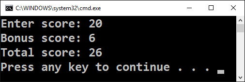

**Подсказка**:

- Основните бонус точки можете да изчислите с `if-else-if-else-if` конструкция (имате 3 случая).
- Допълнителните бонус точки можете да изчислите с `if-else-if` конструкция (имате още 2 случая).

Тестване на решението: https://judge.softuni.bg/Contests/Practice/Index/506#5

### 2. Сумиране на секунди

Трима спортни състезатели финишират за някакъв **брой секунди** (между **1** и **50**). Да се напише програма, която въвежда времената на състезателите и пресмята **сумарното им време** във формат "минути:секунди". Секундите да се изведат с **водеща нула** (2 -> "02", 7 -> "07", 35 -> "35").

Примери:

| Вход | Изход |
| :--- | :---- |
| 35 <br/> 45 <br/> 44 | 2:04 |
| 22 <br/> 7 <br/> 34 | 1:03 |
| 50 <br/> 50 <br/> 49 | 2:29 |
| 14 <br/> 12 <br/> 10 | 0:36 |

### Решение: Сумиране на секунди 

```cs
var sec1 = int.Parse(Console.ReadLine());
// TODO: Read also sec2 and sec3 …
var secs = sec1 + sec2 + sec3;
var mins = 0;
if (secs > 59)   // TODO: Repeat this 2 times …
{ 
  mins++; 
  secs = secs - 60;
}
if (secs < 10)
{ 
  Console.WriteLine(mins + ":" + "0" + secs); 
}
else
{ 
  Console.WriteLine(mins + ":" + secs); 
}
```

**Подсказка**:

- Сумирайте трите числа, за да получите резултата в секунди. Понеже **1 минута = 60** секунди, ще трябва да изчислите броя минути и броя секунди в диапазона от 0 до 59.
- Ако резултатът е между 0 и 59, отпечатайте 0 минути + изчислените секунди.
- Ако резултатът е между 60 и 119, отпечатайте 1 минута + изчислените секунди минус 60.
- Ако резултатът е между 120 и 179, отпечатайте 2 минути + изчислените секунди минус 120.
- Ако секундите са по-малко от 10, изведете водеща нула преди тях.

Тестване на решението: https://judge.softuni.bg/Contests/Practice/Index/506#6

### 3. Конвертор за мерни единици

Да се напише програма, която **преобразува разстояние** между следните **8 мерни единици**: `m, mm, cm, mi, in, km, ft, yd`. Използвайте съответствията от таблицата по-долу:

| Входна eдиница | Изходна eдиница |
| :------------- | :-------------- |
| 1 meter (m) | 1000 millimeters (mm) |
| 1 meter (m) | 100 centimeters (cm) |
| 1 meter (m) | 0.000621371192 miles (mi) |
| 1 meter (m) | 39.3700787 inches (in) |
| 1 meter (m) | 0.001 kilometers (km) |
| 1 meter (m) | 3.2808399 feet (ft)  |
| 1 meter (m) | 1.0936133 yards (yd) |

Входните данни се състоят от три реда:

- Първи ред: число за преобразуване.
- Втори ред: входна мерна единица.
- Трети ред: изходна мерна единица (за резултата).

Примерен вход и изход:

| Вход | Изход |
| :--- | :---- |
| 12 <br/> km <br/> ft | 39370.0788 ft |
| 150 <br/> mi <br/> in | 9503999.99393599 mi |
| 450 <br/> yd <br/> km | 0.41147999937455 yd |

### Решение: Конвертор за мерни единици

```cs
var size = double.Parse(Console.ReadLine());
var sourceMetric = Console.ReadLine().ToLower();
var destMetric = Console.ReadLine().ToLower();
if (sourceMetric == "km")
{ 
  size = size / 0.001; 
}
// Check the other metrics: mm, cm, ft, yd, ...
if (destMetric == "ft")
{ 
  size = size * 3.2808399; 
}
// Check the other metrics: mm, cm, ft, yd, ...
Console.WriteLine(size + " " + destMetric);
```
Тестване на решението: https://judge.softuni.bg/Contests/Practice/Index/506#7

## Дебъгване - прости операции с дебъгер

### Какво е "дебъгване"?

Това е процесът на „**закачане**“ към изпълнението на програмата, който ни позволява да проследим поетапно процеса на изпълнение. Можем да следим **ред по ред** какво се случва с нашата програма, какъв път следва, какви стойности имат дефинираните променливи и много други неща, които ни позволяват да откриваме грешки (**бъгове**).

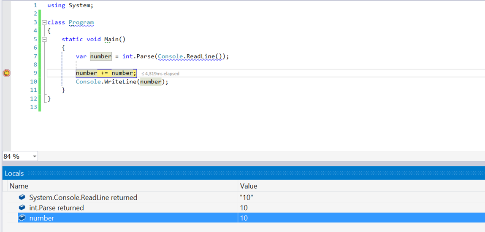

### Дебъгване във Visual Studio

Чрез натискане на бутона **[F10]**, стартираме програмата в **debug режим**. Преминаваме към **следващия ред**, отново с **[F10]**. 

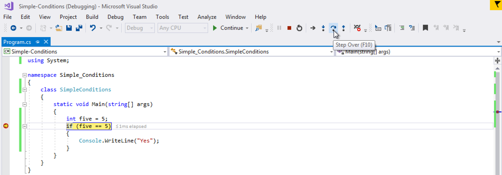

Чрез **[F9]** създаваме стопери – така наречените **breakpoints**, до които можем да стигнем директно използвайки **[F5]** при стартирането на програмата.

## Упражнения: прости проверки

### 0. Празно Visual Studio решение (Blank Solution)

Създайте празно решение (**Blank Solution**) във Visual Studio, за да организирате решенията на задачите от упражненията – всяка задача ще бъде в отделен проект и всички проекти ще бъдат в общ solution.

1. Стартирайте Visual Studio.

2. Създайте нов **Blank Solution**: [File] -> [New] -> [Project]. 

 

3. Изберете от диалоговия прозорец [Templates] -> [Other Project Types] -> [Visual Studio Solutions] -> [**Blank Solution**] и дайте подходящо име на проекта, например “**Simple-Conditions**”:  

 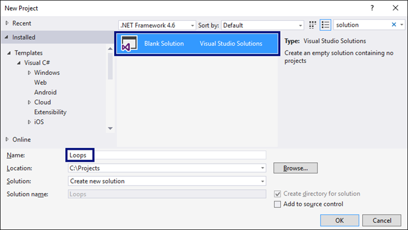

Сега имате създаден празен Visual Studio Solution (без проекти в него):  


### 1. Проверка за отлична оценка

Първата задача от тази тема е, да се напише **конзолна програма**, която **въвежда оценка** (десетично число) и отпечатва “**Excellent!**”, ако оценката е **5.50** или по-висока. Примери:

| Вход | Изход |
| :--- | :---- |
| 6 | Excellent! |
| 5 | (няма изход) |
| 5.5 | Excellent! |
| 5.49 | (няма изход) |

1. Създайте **нов проект** в съществуващото Visual Studio решение. В Solution Explorer кликнете с десен бутон на мишката върху **Solution 'Simple-Conditions'**. Изберете [Add] -> [New Project…]:  

 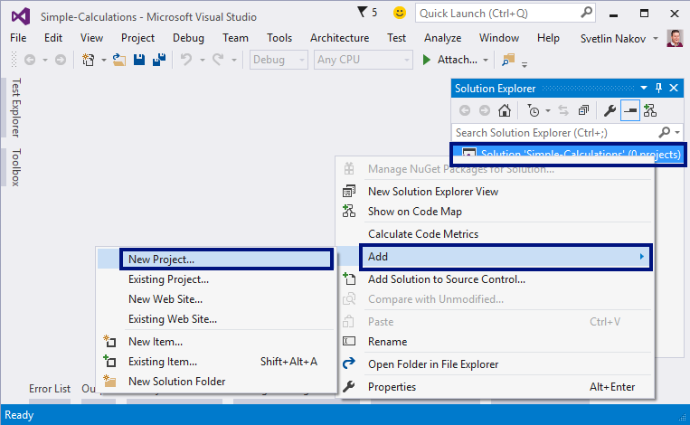

2. Ще се отвори диалогов прозорец за избор на тип проект за създаване. Изберете C# конзолно приложение и задайте име “**Excellent-Result**”:  

 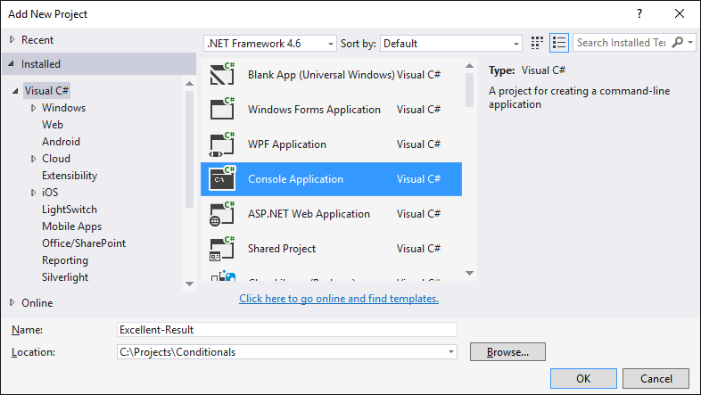  

 Вече имате solution с едно конзолно приложение в него. Остава да напишете кода за решаване на задачата.

3. Отидете в тялото на метода `Main(string[] args)` и напишете решението на задачата. Можете да си помогнете с кода от картинката по-долу:  

 

4. **Стартирайте** програмата с [Ctrl+F5] и я **тествайте** с различни входни стойности:

 

 

5.	**Тествайте** решението си в judge системата: https://judge.softuni.bg/Contests/Practice/Index/506#0. Трябва да получите **100 точки** (напълно коректно решение):  

   

 

### 2. Отлична оценка или не

Следващата задача от тази тема е, да се напише **конзолна програма**, която **въвежда оценка** (десетично число) и отпечатва “**Excellent!**”, ако оценката е **5.50** или по-висока, или “**Not excellent.**” в противен случай. Примери:

| Вход | Изход |
| :--- | :---- |
| 6 | Excellent! |
| 5 | Not excellent. |
| 5.5 | Excellent! |
| 5.49 | Not excellent. |

1. Първо създайте **нов C# конзолен проект** в решението “**Simple-Conditions**”.

 - Кликнете с мишката върху решението в Solution Explorer и изберете [Add] -> [**New Project…**].
 
 - Изберете [Visual C#] -> [Windows] -> [**Console Application**] и задайте име “**Excellent-or-Not**”.
 
2. **Напишете кода** на програмата. Може да си помогнете с примерния код от картинката:  

 

3. Включете режим на **автоматично превключване към текущия проект** като кликнете върху главния solution с десния бутон на мишката и изберете [**Set StartUp Projects…**]:  

 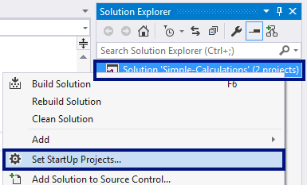  

 Ще се появи диалогов прозорец, от който трябва да се избере [**Startup Project**] -> [**Current selection**]:

 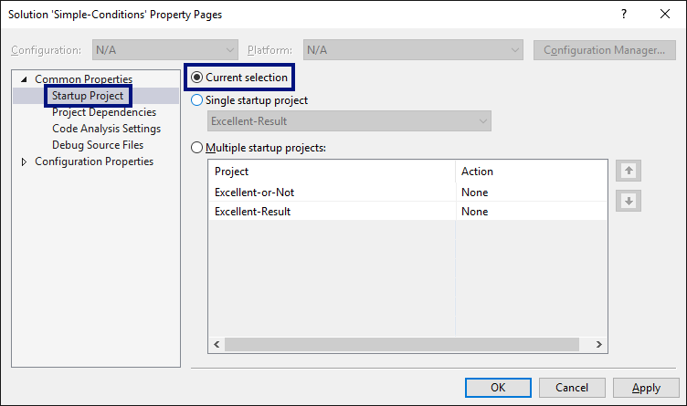 

4. Сега **стартирайте програмата**, както обикновено с [Ctrl+F5] и я тествайте:

 
 

5.	Тествайте в **judge системата**: https://judge.softuni.bg/Contests/Practice/Index/506#1. Решението би трябвало да бъде прието, като напълно коректно: 

 

### 3. Четно или нечетно

Да се напише програма, която въвежда **цяло число** и печата дали е **четно** или **нечетно**. Примери:

| Вход | Изход |
| :--- | :---- |
| 2 | even |
| 3 | odd |
| 25 | even |
| 1024 | odd |

1. Първо добавете **нов C# конзолен проект** в съществуващия solution.

2. **Напишете кода** на програмата. Проверката за четност може да се реализира чрез проверка на **остатъка при деление на 2** по следния начин: `var even = (num % 2 == 0)`.

3. **Стартирайте** програмата с [Ctrl+F5] и я тествайте:  

 

4. Тествайте в **judge системата**: https://judge.softuni.bg/Contests/Practice/Index/506#2.

### 4. Намиране на по-голямото число

Да се напише програма, която въвежда **две цели числа** и отпечатва по-голямото от двете. Примери:

| Вход | Изход |
| :--- | :---- |
| 5 <br/> 3 | 5 |
| 3 <br/> 5 | 5 |
| 10 <br/> 10 | 10 |
| -5 <br/> 5 | 5 |

1. Първо добавете **нов C# конзолен проект** в съществуващия solution.

2. **Напишете кода** на програмата. Необходима е единична `if-else` конструкция.

3. **Стартирайте** програмата с [Ctrl+F5] и я тествайте:

 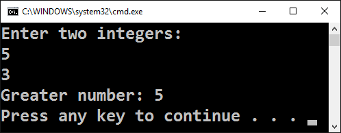

4. Тествайте решението си в **judge системата**: https://judge.softuni.bg/Contests/Practice/Index/506#3.

**Подсказка**: може да си помогнете частично с кода от картинката, който е нарочно замъглен, за да помислите как да си го напишете сами:  


### 5. Изписване на число до 9 с думи

Да се напише програма, която въвежда **цяло число в диапазона [0…9]** и го **изписва с думи** на английски език. Ако числото е извън диапазона, изписва “**number too big**”. Примери:

| Вход | Изход |
| :--- | :---- |
| 5 | five |
| 1 | one |
| 9 | nine |
| 10 | number too big |

Тествайте решението си в **judge системата**: https://judge.softuni.bg/Contests/Practice/Index/506#4.

**Подсказка**: можете да напишете дълга `if-else-if-else…else`, с която да разгледате възможните **11 случая**.

### 6. Познай паролата

Да се напише програма, която **въвежда парола** (един ред с произволен текст) и проверява дали въведеното **съвпада** с фразата “**s3cr3t!P@ssw0rd**”. При съответствие да се изведе “**Welcome**”, а при несъответствие да се изведе “**Wrong password!**”. Примери:

| Вход | Изход |
| :--- | :---- |
| qwerty | Wrong password! |
| s3cr3t!P@ssw0rd | Welcome |
| s3cr3t!p@ss | Wrong password! |

Тествайте решението си в **judge системата**: https://judge.softuni.bg/Contests/Practice/Index/506#8.

**Подсказка**: използвайте `if-else` конструкцията.

### 7. Число от 100 до 200

Да се напише програма, която **въвежда цяло число** и проверява дали е **под 100**, **между 100 и 200** или **над 200**. Да се отпечатат съответно съобщения, като в примерите по-долу:

| Вход | Изход |
| :--- | :---- |
| 95 | Less than 100 |
| 120 | Between 100 and 200 |
| 210 | Greater than 200 |

Тествайте решението си в **judge системата**: https://judge.softuni.bg/Contests/Practice/Index/506#9.

**Подсказка**: използвайте `if-else-if-else` конструкция, за да проверите всеки от трите случая.

### 8. Еднакви думи

Да се напише програма, която **въвежда две думи** и проверява дали са еднакви. Да не се прави разлика между главни и малки букви. Да се изведе “**yes**” или “**no**”. Примери:

| Вход | Изход |
| :--- | :---- |
| Hello <br/> Hello | yes |
| SoftUni <br/> softuni | yes |
| Soft <br/> Uni | no |
| beer <br/> vodka | no |
| HeLlO <br/> hELLo | yes |

Тествайте решението си в **judge системата**: https://judge.softuni.bg/Contests/Practice/Index/506#10.

**Подсказка**: използвайте `if-else` конструкция. Преди сравняване на думите, ги обърнете в долен регистър: `word = word.ToLower()`.

### 9. Информация за скоростта

Да се напише програма, която **въвежда скорост** (десетично число) и отпечатва **информация за скоростта**. При скорост **до 10** (включително), отпечатайте “**slow**”. При скорост **над 10** и **до 50**, отпечатайте “**average**”. При скорост **над 50 и до 150**, отпечатайте “**fast**”. При скорост **над 150 и до 1000**, отпечатайте “**ultra fast**”. При по-висока скорост, отпечатайте “**extremely fast**”. Примери:

| Вход | Изход |
| :--- | :---- |
| 8 | slow |
| 49.5 | average |
| 126 | fast |
| 160 | ultra fast |
| 3500 | extremely fast |

Тествайте решението си в **judge системата**: https://judge.softuni.bg/Contests/Practice/Index/506#11.

**Подсказка**: използвайте серия от `if-else-if-else-…` конструкции, за да хванете всичките 5 случая.

### 10. Лица на фигури

Да се напише програма, която **въвежда размерите на геометрична фигура** и **пресмята лицето й**. Фигурите са четири вида: квадрат (**square**), правоъгълник (**rectangle**), кръг (**circle**) и триъгълник (**triangle**). На първия ред на входа се чете вида на фигурата (`square, rectangle, circle,  triangle`). Ако фигурата е **квадрат**, на следващия ред се чете едно число – дължина на страната му. Ако фигурата е **правоъгълник**, на следващите два реда четат две числа – дължините на страните му. Ако фигурата е **кръг**, на следващия ред чете едно число – радиусът на кръга. Ако фигурата е **триъгълник**, на следващите два реда се четат две числа – дължината на страната му и дължината на височината към нея. Резултатът, да се закръгли до **3 цифри след десетичната точка**. Примери:

| Вход | Изход |
| :--- | :---- |
| square <br/> 5 | 25 |
| rectangle <br/> 7 <br/> 2.5 | 17.5 |
| circle <br/> 6 | 113.097 |
| triangle <br/> 4.5 <br/> 20 | 45 |

Тествайте решението си в **judge системата**: https://judge.softuni.bg/Contests/Practice/Index/506#12.

**Подсказка**: използвайте серия от `if-else-if-else-…` конструкции, за да обработите 4-те вида фигури.

### 11. Време + 15 минути

Да се напише програма, която **въвежда час и минути** от 24-часово денонощие и изчислява колко ще е **часът след 15 минути**. Резултатът, да се отпечата във формат `hh:mm`. Часовете винаги са между 0 и 23, а минутите винаги са между 0 и 59. Часовете се изписват с една или две цифри. Минутите се изписват винаги с по две цифри, с **водеща нула** когато е необходимо. Примери:

| Вход | Изход |
| :--- | :---- |
| 1 <br/> 46 | 2:01 |
| 0 <br/> 01 | 0:16 |
| 23 <br/> 59 | 0:14 |
| 11 <br/> 08 | 11:23 |
| 12 <br/> 49 | 13:04 |

Тествайте решението си в **judge системата**: https://judge.softuni.bg/Contests/Practice/Index/506#13.

**Подсказка**: добавете 15 минути и направете няколко проверки. Ако минутите надвишат 59, увеличете часовете с 1 и намалете минутите с 60. По аналогичен начин разгледайте случая, когато часовете надвишат 23. При печатането на минутите, проверете за водеща нула.

### 12. Еднакви 3 числа

Да се напише програма, в която се въвеждат 3 числа и се отпечатва дали те са еднакви (yes / no). Пример:

| Вход | Изход |
| :--- | :---- |
| 5 <br/> 5 <br/> 5 | yes |
| 5 <br/> 4 <br/> 5 | no |
| 1 <br/> 2 <br/> 3 | no |

Тествайте решението си в **judge системата**: https://judge.softuni.bg/Contests/Practice/Index/506#14.

### 13. * Изписване на число от 0 до 100 с думи

Да се напише програма, която превръща число [0…100] в текст. Пример:

| Вход | Изход |
| :--- | :---- |
| 25 | twenty five |
| 42 | forty two |
| 6  | six |

Тествайте решението си в **judge системата**: https://judge.softuni.bg/Contests/Practice/Index/506#15.

## Графични и Web приложения: Конвертор за валути

Създайте графично (**GUI**) приложение за **конвертиране на валути**. Приложението трябва да изглежда приблизително като на картинката по-долу:  


1. Създайте нов **Windows Forms Application** с име “**Currency-Converter**”:

 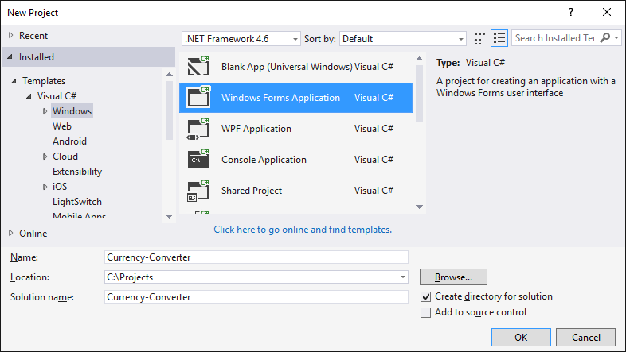

2. **Наредете контролите** във формата: една кутийка за въвеждане на число (**NumericUpDown**), един падащ списък с валути (**ComboBox**), текстов блок за резултата (**Label**) и няколко надписа (**Label**). Нагласете **размерите** и свойствата им, за да изглеждат долу-горе като на картинката:
 
 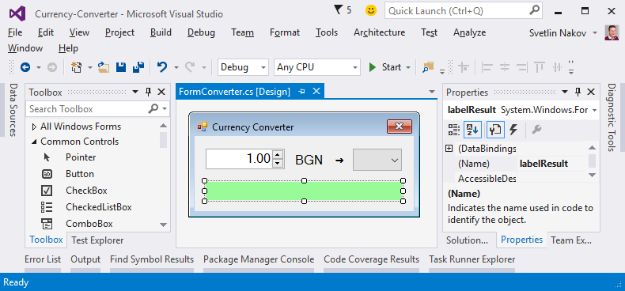
 
3. Задайте следните препоръчителни **настройки на контролите**:

 - **За главната форма** (**Form**), която съдържа всички контроли:
  - `(name)` = `FormConverter`
  - `Text` = "**Currency Converter**"
  - `Font.Size` = **12**
  - `MaximizeBox` = `False`
  - `MinimizeBox` = `False`
  - `FormBorderStyle` = `FixedSingle`
     
 - За **полето за въвеждане на число** (**NumericUpDown**):
  - `(name)` = `numericUpDownAmount`
  - `Value` = **1**
  - `Minimum` = **0**
  - `Maximum` = **1000000**
  - `TextAlign` = `Right`
  - `DecimalPlaces` = **2**
     
 - За **падащия списък в валутите** (**ComboBox**):
  - `(name)` = `comboBoxCurrency`
  - `DropDownStyle` = `DropDownList`
  - `Items` =
   - **EUR**
   - **USD**
   - **GBP**
         
 - За **текстовия блок за резултата** (**Label**):
  - `(name)` = `labelResult`
  - `AutoSize `= `False`
  - `BackColor` = `PaleGreen`
  - `TextAlign` = `MiddleCenter`
  - `Font.Size` = **14**
  - `Font.Bold` = `True`
     
4. Хванете следните **събития**, за да напишете C# кода, който ще се изпълни при настъпването им:

  - Събитието `ValueChanged` на контролата за въвеждане на число `numericUpDownAmount`: 
  
  

  - Събитието `Load` на формата `FormConverter`.
  - Събитието `SelectedIndexChanged` на падащия списък за избор на валута `comboBoxCurrency`.
  
5.	Напишете следния **C# код** за обработка на събитията:

```cs
private void FormConverter_Load(object sender, EventArgs e)
{
  this.comboBoxCurrency.SelectedItem = "EUR";
}
        
private void numericUpDownAmount_ValueChanged(object sender, EventArgs e)
{
  ConvertCurrency();
}
        
private void comboBoxCurrency_SelectedIndexChanged(object sender, EventArgs e)
{
  ConvertCurrency();
}
```

Задачата на горния код е, да избере при стартиране на програмата валута “**EUR**” и при промяна на стойностите в полето за сума или при смяна на валутата, да изчисли резултата, извиквайки `ConvertCurrency()`.

6.Следва да се напише действието `ConvertCurrency()` за конвертиране на въведената сума от лева в избраната валута:
 
```cs
private void ConvertCurrency()
{
  var originalAmount = this.numericUpDownAmount.Value;
  var convertedAmount = originalAmount;
  if (this.comboBoxCurrency.SelectedItem.ToString() == "EUR")
      {
        convertedAmount = originalAmount / 1.95583m;
      }
  else if (this.comboBoxCurrency.SelectedItem.ToString() == "USD")
      {
        convertedAmount = originalAmount / 1.80810m;
      }
  else if (this.comboBoxCurrency.SelectedItem.ToString() == "GBP")
      {
        convertedAmount = originalAmount / 2.54990m;
      }
  this.labelResult.Text = originalAmount + " лв. = " +
  Math.Round(convertedAmount, 2) + " " + this.comboBoxCurrency.SelectedItem;
}
```

Горният код взима **сумата** за конвертиране от полето `numericUpDownAmount` и **избраната валута** за резултата от полето `comboBoxCurrency`. След това с **условна конструкция**, според избраната валута, сумата се дели на **валутния курс** (който е фиксиран твърдо в сорс кода). Накрая се генерира текстово **съобщение с резултата** (закръглен до 2 цифри след десетичната точка) и се записва в зелената кутийка `labelResult`.
