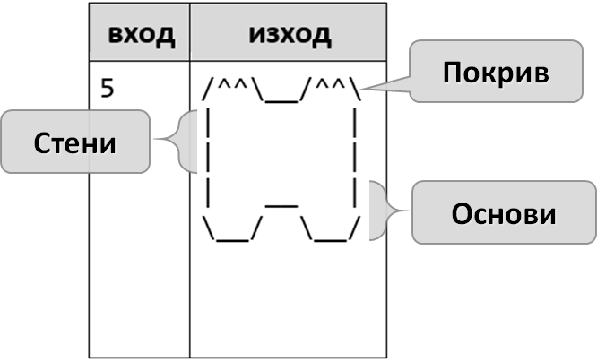

# Глава 6. Чертане на фигурки с цикли - изпитни задачи
В тази глава ще решим няколко задачи, включващи чертане на фигури с цикли, ще се запознаем с някои основни стратегии и ще разгледаме най-често срещаните бъгове. 
## Чертане на крепост
Зададена ни е следната задача
Да се напише програма, която прочита от конзолата цяло число **n** и чертае крепост с ширина **2 * n** колони и височина **n** реда. Лявата и дясната колона във вътрешността си са широки **n / 2**.

### Входни данни
Входът е цяло число **n** в интервала **[3…1000].**
### Изходни данни
Да се отпечатат на конзолата **n** текстови реда, изобразяващи **крепостта**, точно както в примерите.
### Примерен вход и изход
Следват няколко тестови примера, които ще са главният ни ориентир за писането на кода:

TODO: По добър начин за изобразяване на входно-изходни данни

### Насоки и подсказки
- За да може да "обединиме" примерите в един алгоритъм, ще трябва да изследваме какво се повтаря във всеки пример. Разлгеждайки тестовите примери по редове, може да  разграничим различни групи.

### Тестване в Judge системата

## Пеперуда

TODO: описание

TODO: картинка

### Входни данни

### Изходни данни

### Примерен вход и изход

### Насоки и подсказки

### Тестване в Judge системата

## Знак "Стоп"

TODO: описание

TODO: картинка

### Входни данни

### Изходни данни

### Примерен вход и изход

### Насоки и подсказки

### Тестване в Judge системата

## TODO: да се добавят още 2-3 изпитни задачи за чертане на фигурки

